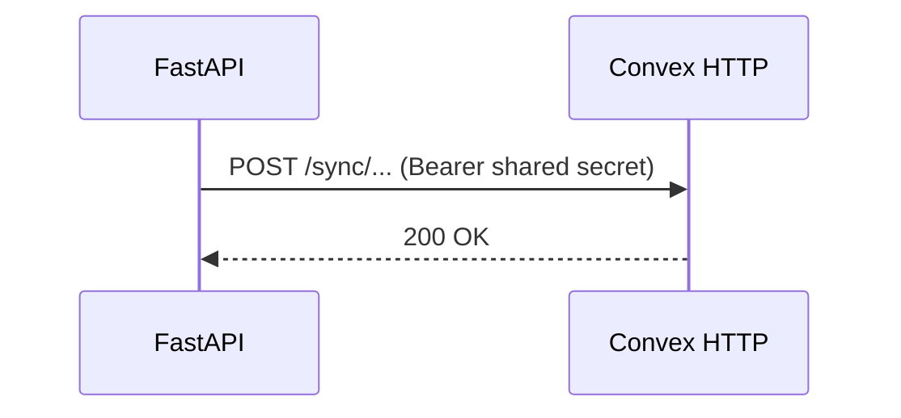
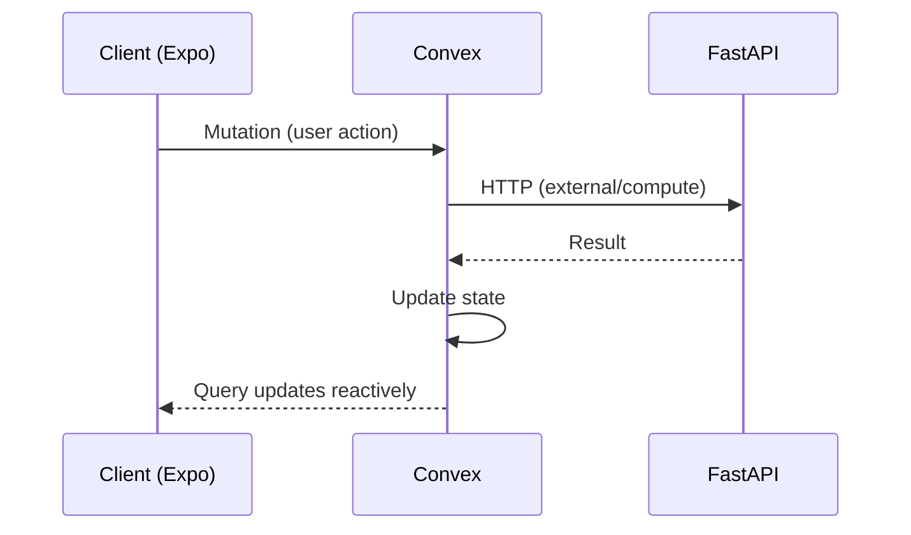

# FastAPI ↔ Convex Interaction

Service boundary between FastAPI and Convex: one owner per concern and directional patterns.

- [Ownership](#ownership-split) · [FastAPI → Convex](#1-fastapi--convex-data-sync) · [Convex → FastAPI](#2-convex--fastapi) · [Event-driven](#3-event-driven-updates) · [Checklist](#decision-checklist) · [Docs](#docs)

## Ownership split

| Use case                                            | Owner   | Why                                      |
| --------------------------------------------------- | ------- | ---------------------------------------- |
| Realtime collaborative state in mobile UI           | Convex  | Low-latency reactive queries.            |
| Client reads/writes that update UI live             | Convex  | Mobile already uses Convex (`useQuery`). |
| Heavy compute, orchestration, external integrations | FastAPI | Python and async HTTP fit.               |
| Webhooks, scheduled jobs, ingestion                 | FastAPI | Long-running/integration-heavy.          |

## 1. FastAPI → Convex (data sync)

Use when FastAPI owns the workflow but Convex needs an updated projection for clients (e.g. ingest in FastAPI, then sync to Convex).



Call Convex HTTP endpoint with shared secret; Convex updates tables; clients react via queries. Example: `httpx.post(CONVEX_HTTP_ENDPOINT, headers={"Authorization": f"Bearer {CONVEX_SHARED_SECRET}"}, json=payload)`.

## 2. Convex → FastAPI

Use a Convex **action** when a Convex workflow needs heavy compute or external APIs (e.g. mutation stores intent, action calls FastAPI for scoring).

```ts
// Convex action
const response = await fetch("http://localhost:8001/integrations/...", {
  method: "POST",
  headers: { "Content-Type": "application/json" },
  body: JSON.stringify({ ... }),
});
```

## 3. Event-driven updates



Rules: one canonical owner per entity; no dual writes; make cross-service calls idempotent and traceable (request/event id). For ingestion (scraper → FastAPI/Convex), see [Scraper ingestion](scraper-ingestion.md#ownership-rule).

## Decision checklist

1. **Realtime client fanout?** → Convex owns client state.
2. **Heavy compute, webhooks, cron, third-party?** → FastAPI owns execution.
3. **Both involved?** → Define one canonical owner and one projection target before coding.

## Docs

| Doc                                           | Description                  |
| --------------------------------------------- | ---------------------------- |
| [Authentication](../guides/authentication.md) | Clerk, Convex, FastAPI auth. |
| [Scraper ingestion](scraper-ingestion.md)     | Scraper → API/Convex.        |
