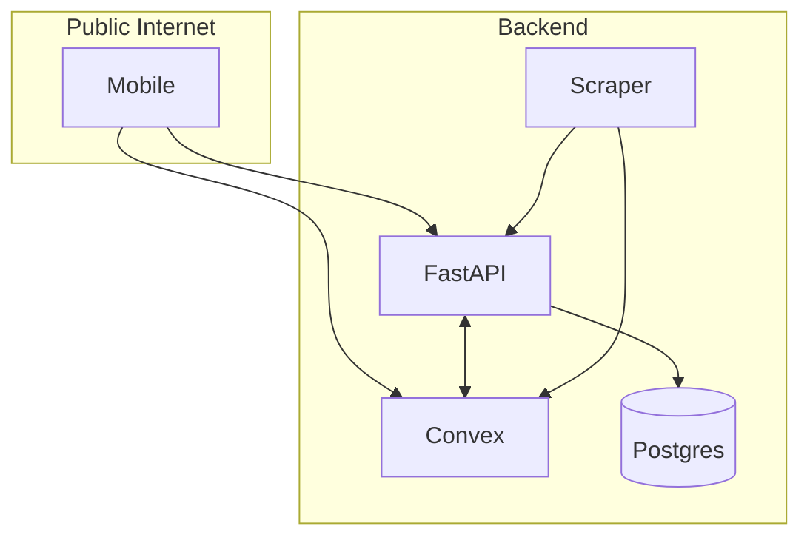

# Production overview

What production looks like for korb.guru: traceability, env model, service seams, and config. For **before-production checks and deploy steps**, see [Deploy and rollback](../runbooks/deploy-and-rollback.md). For **store and app compliance**, see [App Store compliance](../guides/app-store-compliance-checklist.md).

- [Traceability](#deployment-traceability-korbguru) · [Environment](#environment-separation) · [Service seams](#service-seams) · [Config](#config-layering) · [Logging](#logging) · [Docs](#docs)

## Deployment traceability (korb.guru)

| Target          | Identity / URL                                            | Where                                                     |
| --------------- | --------------------------------------------------------- | --------------------------------------------------------- |
| Product domain  | `korb.guru`                                               | Deep links, web, marketing.                               |
| Website         | `https://korb.guru` (landing, privacy, `/go/*` deep-link) | `apps/website`; Vercel.                                   |
| Mobile (stores) | **Korb Guru**; bundle `guru.korb.mobile`                  | `apps/mobile/app.json`.                                   |
| FastAPI         | e.g. `https://api.korb.guru`                              | EAS env; API host.                                        |
| Convex          | Convex-hosted URL (e.g. `*.convex.cloud`)                 | `CONVEX_DEPLOYMENT`; mobile via `EXPO_PUBLIC_CONVEX_URL`. |
| EAS Build       | **Korb Guru** binaries; profiles inject API/Convex URLs   | `apps/mobile/eas.json`.                                   |

## Environment separation

| Concern        | Local                                            | Staging/Prod                              |
| -------------- | ------------------------------------------------ | ----------------------------------------- |
| Convex         | `convex dev`                                     | Prod deployment URL.                      |
| FastAPI        | `localhost:8001`                                 | Service DNS, health, graceful shutdown.   |
| Mobile API URL | `http://localhost:8001` / `http://10.0.2.2:8001` | e.g. `https://api.korb.guru`, TLS.        |
| Clerk          | `pk_test_*` / `sk_test_*`                        | Production keys.                          |
| CORS           | `localhost:*`                                    | Production origins only (`CORS_ORIGINS`). |

Never commit secrets. Production auth: set `CLERK_JWT_ISSUER_DOMAIN` (or `CLERK_JWKS_URL`) and `INGEST_API_KEY` so dev bypasses are off (see [Auth reference](../reference/auth.md)). Local env files: see [Local development](../guides/local-dev.md); inject at deploy via platform env.

## Service seams

| Seam                     | Protocol  | Auth                        | Note                 |
| ------------------------ | --------- | --------------------------- | -------------------- |
| Mobile → FastAPI         | HTTPS     | Clerk JWT                   | Rate limiting, logs. |
| Mobile → Convex          | WSS/HTTPS | Convex (Clerk)              | Convex handles auth. |
| FastAPI ↔ Convex         | HTTPS     | Shared secret / Convex auth | Tracing, timeouts.   |
| Scraper → FastAPI/Convex | HTTPS     | API key / secret            | Ingestion limits.    |

## Config layering

Override, don't duplicate: defaults → env vars → runtime. FastAPI: pydantic-settings. Convex: `convex.json` + dashboard. Mobile: `EXPO_PUBLIC_*` at build via EAS.

## Logging

FastAPI and Scraper: Python `logging` → stdout. Convex: dashboard. Mobile: console/Metro. Use a consistent structure (timestamp, level, service, request_id); propagate `request_id` across Mobile → FastAPI → Convex.

## What this document does not cover

Infra (containers, IaC, CI/CD, monitoring, secret managers) is out of scope; document when you adopt it.

## Docs

| Doc                                                                 | Description                                                   |
| ------------------------------------------------------------------- | ------------------------------------------------------------- |
| [Deploy and rollback](../runbooks/deploy-and-rollback.md)           | Deploy order, **before-production checks**, rollback, config. |
| [App Store compliance](../guides/app-store-compliance-checklist.md) | Store and backend checklist.                                  |
| [Auth reference](../reference/auth.md)                              | Env vars and auth.                                            |
| [Local development](../guides/local-dev.md)                         | Port map and local env.                                       |
| [FastAPI ↔ Convex](fastapi-convex-interaction.md)                   | Service boundaries.                                           |
