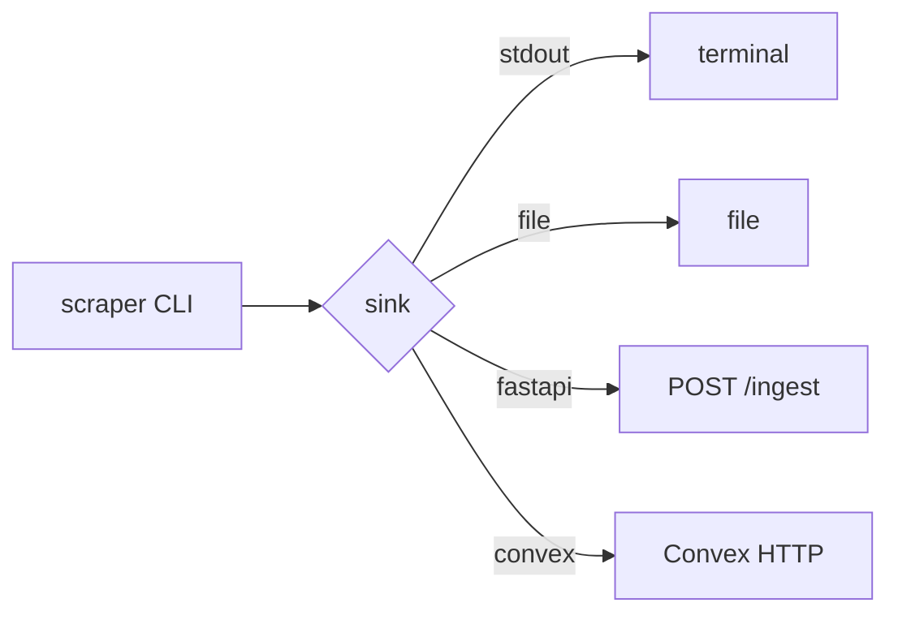

# Scraper Ingestion

How `apps/scraper` hands off mock (or future scraped) records to the backend.

- [Current pattern](#current-mock-pattern) · [Sinks](#ingestion-handoff-options) · [Ownership](#ownership-rule) · [Evolution](#evolution-path) · [Docs](#docs)

## Current mock pattern

Scraper generates deterministic mock recipe/user records and defaults to **stdout**:

```bash
cd apps/scraper
uv run scraper --sink stdout --format json --limit 3
```

Zero external deps; easy to redirect to file or pipe. Use for scaffold validation.



## Ingestion handoff options

One sink per run.

| Sink        | Use case                   | Command                                                                                 |
| ----------- | -------------------------- | --------------------------------------------------------------------------------------- |
| **stdout**  | Local debug, fixtures      | `uv run scraper --sink stdout --format jsonl [--limit N]`                               |
| **file**    | Reproducible payloads      | `uv run scraper --sink file --output-file ./.tmp/mock.json [--limit N]`                 |
| **fastapi** | FastAPI owns workflow      | `uv run scraper --sink fastapi --endpoint-url http://127.0.0.1:8000/ingest [--limit N]` |
| **convex**  | Convex-owned entities only | `uv run scraper --sink convex --endpoint-url https://<convex-http> [--limit N]`         |

FastAPI sink: payload has `source`, `sink`, `recordCount`, `records`. Response: `{ status, accepted, source }`. Do not duplicate canonical ownership (FastAPI vs Convex).

## Ownership rule

Scraper feeds **one** canonical owner per entity per flow. Same rule for all service boundaries: see [FastAPI ↔ Convex](fastapi-convex-interaction.md#ownership-split).

- FastAPI-owned → scraper → FastAPI (`/ingest` or specific endpoint).
- Convex-owned → scraper → Convex HTTP API.
- Avoid dual writes of the same entity in one run.

Recommended order: start with stdout/file, then add FastAPI sink for integration checks; use Convex sink only when the target entity is Convex-owned.

## Evolution path

Out of scope for scaffold: delivery retries with idempotency, queue/scheduler, dead-letter and replay, schema validation against shared contracts. Add when ownership is stable.

## Docs

| Doc                                               | Description         |
| ------------------------------------------------- | ------------------- |
| [FastAPI ↔ Convex](fastapi-convex-interaction.md) | Service boundaries. |
| [Production overview](production-overview.md)     | Env and deployment. |
