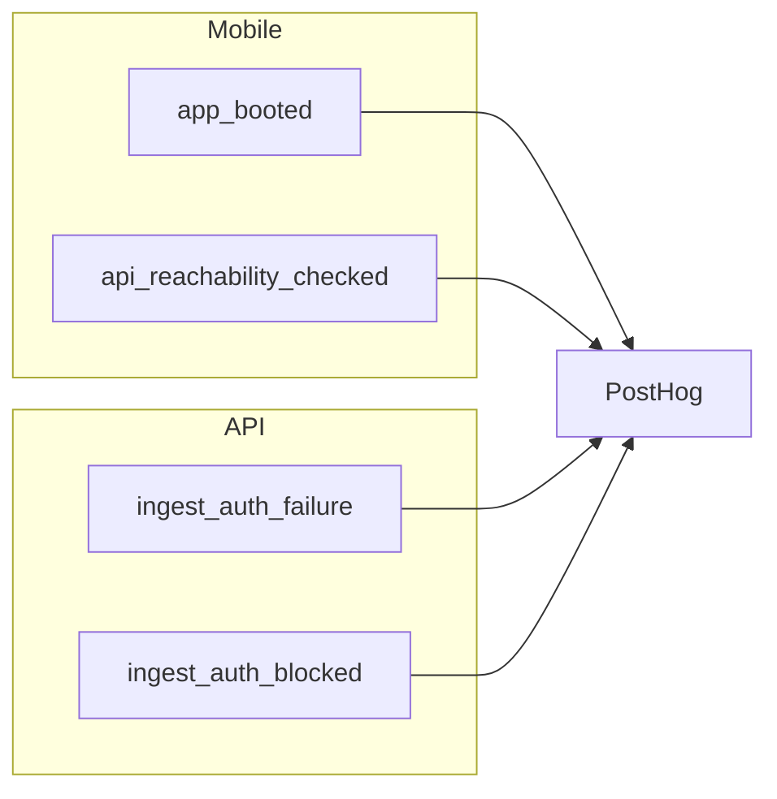

# Analytics (PostHog)

**In this guide you will:** wire PostHog into the mobile app and FastAPI, capture `app_booted` and `api_reachability_checked` from the client and `ingest_auth_failure` / `ingest_auth_blocked` from the API, and keep a clear ownership boundary between mobile and server events.

- [Scope](#scope) · [Ownership](#ownership-boundary) · [Mobile](#mobile-plan-expo) · [FastAPI](#fastapi-plan) · [Docs](#docs)

## Scope

Use analytics for integration health only:

- Mobile app boot and API reachability.
- API-side ingestion/security traces.
- No full product analytics taxonomy in scaffold.

## Ownership boundary

| Event category                     | Owner   | Why                                                          |
| ---------------------------------- | ------- | ------------------------------------------------------------ |
| App lifecycle, client UX signals   | Mobile  | Event is client-originated and session/device context.       |
| API ingest/security, server traces | FastAPI | Event is server-authoritative; do not trust client emission. |

Rules: do not emit the same semantic event from both; include `source: "mobile"` or `source: "api"` in properties; keep the event set small.

## Mobile plan (Expo)

**Current implementation:** PostHog is bootstrapped in `apps/mobile/src/lib/posthog.ts` (`initPostHog()`, `usePostHog()`, `trackEvent`, `identifyUser`, `resetUser`). The root layout `apps/mobile/src/app/_layout.tsx` calls `usePostHog()` so the client initializes once at startup. Env: `EXPO_PUBLIC_POSTHOG_API_KEY`, optional `EXPO_PUBLIC_POSTHOG_HOST`.

**Optional next steps:**

1. **Events** — Emit the initial events below from the appropriate places (e.g. after init for `app_booted`, after health check for `api_reachability_checked`) using `trackEvent` from `@/lib/posthog`.

Initial events:

| Event                      | When                             | Properties                                          |
| -------------------------- | -------------------------------- | --------------------------------------------------- |
| `app_booted`               | Once after PostHog init          | `source: "mobile"`, `platform`, `app_version`       |
| `api_reachability_checked` | After FastAPI health/hello probe | `source: "mobile"`, `ok`, `status_code`, `base_url` |

Env: `EXPO_PUBLIC_POSTHOG_API_KEY`, `EXPO_PUBLIC_POSTHOG_HOST` (optional).

## FastAPI plan

**Current implementation:** PostHog is centralized in `apps/api/src/analytics.py` (capture helpers with `distinct_id="api"`, `$process_person_profile=false`; no-op when key is unset or placeholder). `main.py` flushes PostHog after each request; auth uses `capture_ingest_auth_failure` and `capture_ingest_auth_blocked` from `auth.py` and `ingest_ratelimit.py`.

Initial events:

| Event                 | When                                   |
| --------------------- | -------------------------------------- |
| `ingest_auth_failure` | Invalid or missing ingest credentials. |
| `ingest_auth_blocked` | Request blocked by per-IP backoff.     |

Use `distinct_id="api"`, `$process_person_profile=false`. No-op when key is unset or placeholder.

## Docs

| Doc                                                               | Description                          |
| ----------------------------------------------------------------- | ------------------------------------ |
| [Auth reference](../reference/auth.md)                            | PostHog env and API security events. |
| [FastAPI ↔ Convex](../architecture/fastapi-convex-interaction.md) | Service ownership.                   |
| [Local development](local-dev.md)                                 | Env and endpoints.                   |
