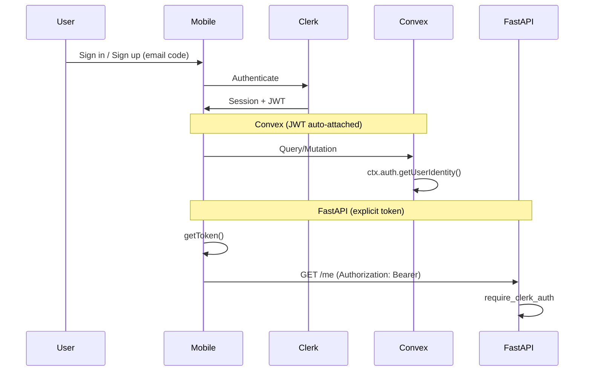

# Authentication

**In this guide you will:** use the unified mobile auth screen, call protected Convex and FastAPI endpoints from the client, and add new protected endpoints or Convex functions. Auth in the Korb stack uses Clerk (sessions and JWT), Convex (JWT auto-attached), and FastAPI (Bearer token).

- [Overview](#overview) · [Mobile sign-in/sign-out](#mobile-sign-in-and-sign-out) · [Convex](#mobile-calling-convex-authenticated) · [FastAPI](#mobile-calling-fastapi-protected-endpoints) · [Handle and deep links](#handle-and-deep-links) · [Docs](#docs)

## Overview

| Layer       | Role                                                                                     |
| ----------- | ---------------------------------------------------------------------------------------- |
| **Clerk**   | Sign-in/sign-up, session and JWT, secure storage on device.                              |
| **Convex**  | Receives Clerk JWT from the client; use `ctx.auth.getUserIdentity()` in functions.       |
| **FastAPI** | Receives `Authorization: Bearer <token>`; use `require_clerk_auth` for protected routes. |



## Mobile sign-in and sign-out

Expo Router route groups:

| Group    | Purpose                                                       |
| -------- | ------------------------------------------------------------- |
| `(auth)` | Unified sign-in and sign-up screen; shown when not signed in. |
| `(home)` | Main app (handle, profile, sign-out); shown when signed in.   |

Flow: (1) Root `index` redirects to `/(home)` if signed in, else `/(auth)`. (2) The unified auth screen uses email code for both sign-in and sign-up. Sign-in follows the legacy Clerk Expo flow: `signIn.create({ identifier })` → `prepareFirstFactor({ strategy: "email_code", emailAddressId })` → `attemptFirstFactor({ strategy: "email_code", code })`. If the email does not exist, the app falls back from sign-in to sign-up on the same screen. (3) Sign-up uses `prepareEmailAddressVerification()` and `attemptEmailAddressVerification()`. (4) Completion uses Clerk `setActive({ session: createdSessionId })`. (5) After sign-in, the app syncs the Convex user via `users.syncFromClerk`; the user can set a **handle** and sign out. (6) Sign-out uses `SignOutButton` → Clerk `signOut()` → redirect to `/(auth)`.

### Current working mobile stack

- Package: `@clerk/clerk-expo@2.19.31`
- Provider chain: `ClerkProvider` → `ConvexProviderWithClerk`
- Unified auth screen: `apps/mobile/src/app/(auth)/index.tsx`
- Convex client auth: plain `ConvexProviderWithClerk client={convex} useAuth={useAuth}`

This repo is intentionally pinned to the older Clerk Expo package because that is the stack validated against the current Convex Expo integration. See the historical note in [Clerk Expo downgrade report](../archive/clerk-expo-convex-auth-downgrade-2026-03.md).

## Mobile: calling Convex (authenticated)

Convex client uses `ConvexProviderWithClerk`; the client sends the Clerk JWT automatically. In Convex functions, require auth by checking `ctx.auth.getUserIdentity()` and throw if `null`:

```ts
const identity = await ctx.auth.getUserIdentity();
if (!identity) throw new Error("Not authenticated");
// identity.subject = Clerk user id
```

See `convex/users.ts` (e.g. `getCurrent`, `setHandle`, `syncFromClerk`). [Auth reference](../reference/auth.md#convex-authenticated-functions).

## Mobile: calling FastAPI (protected endpoints)

Send the standard Clerk session token in the header:

```http
Authorization: Bearer <clerk_session_token>
```

Get the token with `useAuth().getToken()` and call `fetchMe(token)` or `apiFetchWithAuth(path, token)` from `@/lib/api`. The helper adds the Bearer header. FastAPI does **not** use the Convex JWT template; that template is only for Convex. [Auth reference](../reference/auth.md#fastapi-protected-endpoints).

## Adding a protected FastAPI endpoint

1. Add a route with `Depends(require_clerk_auth)`.
2. Register the router in `main.py` and call it from the app via `apiFetchWithAuth(path, token)` with `getToken()`.

See [Auth reference](../reference/auth.md#fastapi-protected-endpoints) for production JWT verification.

## Adding an authenticated Convex function

1. In the handler, get identity with `ctx.auth.getUserIdentity()` and throw if `null`.
2. Use `identity.subject` as the stable Clerk user id (e.g. for the `users` table by `clerkId`).
3. See `convex/users.ts` for the auth pattern (e.g. `getCurrent`, `setHandle`).

## Handle and deep links

Users set a **handle** (3–30 chars, alphanumeric + underscore) on the home screen. Stored in Convex; used for deep links (e.g. `korb.guru/add/<handle>`). Convex: `users.getByHandle`, `users.setHandle` (authenticated).

## Docs

| Doc                                    | Description                                            |
| -------------------------------------- | ------------------------------------------------------ |
| [Auth reference](../reference/auth.md) | Env vars, endpoints, Convex functions, production JWT. |
| [Local development](local-dev.md)      | Ports and env.                                         |
