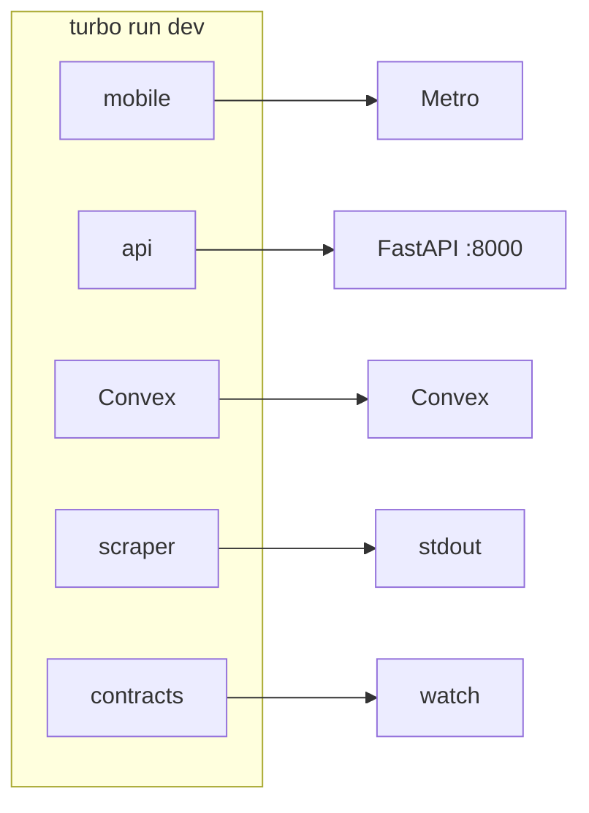

# Local development

Run the full stack from the repo root: ports, env vars, and how to run a single service.

- [What `pnpm dev` starts](#what-pnpm-dev-starts) · [Port map](#port-map) · [Mobile env](#mobile-environment-variables) · [One service](#running-one-service-only) · [Pre-commit](#pre-commit-hygiene)

## What `pnpm dev` starts

```bash
pnpm install
pnpm dev
```

`pnpm dev` runs `turbo run dev` and starts all dev processes.



| Workspace         | Purpose                   |
| ----------------- | ------------------------- |
| `@korb/mobile`    | Expo Metro.               |
| `@korb/api`       | FastAPI on port 8000.     |
| `@korb/convex`    | Convex dev backend.       |
| `@korb/scraper`   | Scraper mock output.      |
| `@korb/contracts` | Shared contracts watcher. |

Single app from root: `pnpm dev:mobile`, `pnpm dev:api`, `pnpm dev:convex`, `pnpm dev:website`. Or `pnpm --filter @korb/<name> dev` for any workspace.

## Port map

| Service    | Port | URL                                         |
| ---------- | ---- | ------------------------------------------- |
| FastAPI    | 8000 | http://localhost:8000                       |
| Expo Metro | 8081 | http://localhost:8081                       |
| Convex     | —    | Set `EXPO_PUBLIC_CONVEX_URL` in mobile env. |

## Mobile environment variables

Set in `apps/mobile/.env`.

| Variable                            | Purpose                |
| ----------------------------------- | ---------------------- |
| `EXPO_PUBLIC_API_BASE_URL`          | FastAPI base URL.      |
| `EXPO_PUBLIC_CONVEX_URL`            | Convex deployment URL. |
| `EXPO_PUBLIC_CLERK_PUBLISHABLE_KEY` | Clerk publishable key. |

```env
# iOS Simulator
EXPO_PUBLIC_API_BASE_URL=http://localhost:8000

# Android Emulator
EXPO_PUBLIC_API_BASE_URL=http://10.0.2.2:8000
```

## Mobile: check and security

From `apps/mobile`: `pnpm run check` (lint + typecheck), `pnpm run check:security` (no secrets, auth layouts). Run before committing.

## Running one service only

| Command            | Workspace     |
| ------------------ | ------------- |
| `pnpm dev:mobile`  | @korb/mobile  |
| `pnpm dev:api`     | @korb/api     |
| `pnpm dev:convex`  | @korb/convex  |
| `pnpm dev:website` | @korb/website |

Any workspace: `pnpm --filter @korb/api dev`, etc.

## Pre-commit hygiene

Husky installs on `pnpm install`. `lint-staged`: Prettier (Node), ESLint (mobile/packages/convex), Ruff (api/scraper). Typecheck and tests run in CI. Skip: `git commit --no-verify`.

## See also

- [Authentication](authentication.md) · [Contracts and codegen](contracts.md) · [Auth reference](../reference/auth.md)
