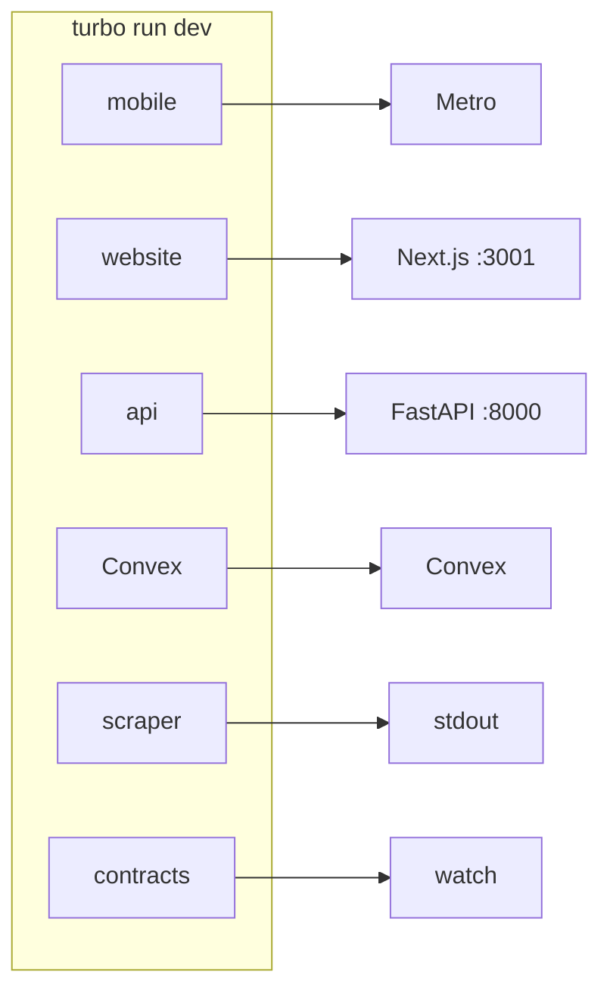

# Local development

Run the repo from the root: what `pnpm dev` actually starts, what CI enforces today, and which Turbo optimizations are still staged.

- [What `pnpm dev` starts](#what-pnpm-dev-starts) · [Turbo behavior today](#turbo-behavior-today) · [CI today](#ci-today) · [Port map](#port-map) · [Mobile env](#mobile-environment-variables) · [One service](#running-one-service-only) · [Pre-commit](#pre-commit-hygiene)

## What `pnpm dev` starts

```bash
pnpm install
pnpm dev
```

`pnpm dev` runs `turbo run dev`. In this repo, that means every workspace with a `dev` script starts, not just the mobile/backend path.



| Workspace         | Purpose                   |
| ----------------- | ------------------------- |
| `@korb/mobile`    | Expo Metro.               |
| `@korb/website`   | Next.js dev server.       |
| `@korb/api`       | FastAPI on port 8000.     |
| `@korb/convex`    | Convex dev backend.       |
| `@korb/scraper`   | Scraper mock output.      |
| `@korb/contracts` | Shared contracts watcher. |

Single app from root: `pnpm dev:mobile`, `pnpm dev:api`, `pnpm dev:convex`, `pnpm dev:website`. Or `pnpm --filter @korb/<name> dev` for any workspace.

## Turbo behavior today

Turbo is configured conservatively in this scaffold:

- **Local cache only**: `turbo.json` defines task outputs, but there is no remote cache wiring in the repo or CI. `TURBO_TOKEN` / `TURBO_TEAM` are not configured.
- **Persistent dev tasks**: `dev` is marked `persistent` and `cache: false`, so `pnpm dev` always launches fresh long-running processes.
- **No affected-only execution**: Root scripts and GitHub Actions run broad commands such as `turbo run lint`, `turbo run test`, and `turbo run build`. No `--affected` flow is wired today.

Future improvements, not current behavior:

- **Remote Turbo cache** can speed up CI and branch-to-branch work once the team is ready to manage Turbo credentials and cache invalidation centrally.
- **Affected-only execution** is worth revisiting after the repo defines a stable base-ref strategy for pull requests and documents the tradeoff: faster feedback in exchange for more CI logic and a higher risk of hiding cross-workspace drift.

## CI today

GitHub Actions currently enforces these jobs:

- `install` — installs Node and Python toolchains, caches the pnpm store, caches root `node_modules`, and enables `uv` caching
- `lint` — runs `pnpm format:check`, `pnpm lint`, `pnpm typecheck`, `pnpm contracts:generate`, then fails if generated contracts drift from committed files
- `test` — runs `pnpm test` across the monorepo
- `mobile-build` — exports the Expo app for iOS and Android
- `python-lint-api` and `python-lint-scraper` — run Ruff lint and format checks in each Python app
- `api-health` — boots FastAPI locally in CI and curls `/health`

Important scope notes:

- The website participates in `pnpm test`, but its package still uses a placeholder `test` script. CI therefore does not provide real website test coverage yet.
- CI does not run a dedicated website build job today.
- CI uses GitHub Actions cache plus package-manager caching; it does not use Turbo remote cache.
- CI does not use affected-only execution; every run executes the configured repo-wide commands.

## Port map

| Service    | Port | URL                                         |
| ---------- | ---- | ------------------------------------------- |
| FastAPI    | 8000 | http://localhost:8000                       |
| Expo Metro | 8081 | http://localhost:8081                       |
| Convex     | —    | Set `EXPO_PUBLIC_CONVEX_URL` in mobile env. |

## Environment variables

### One place for local development (root `.env`)

You can use a **single root `.env`** so there is one place to define and manage variables for local dev:

1. Copy root `.env.example` to **root** `.env`: `cp .env.example .env`
2. Run dev from the repo root: `pnpm dev` or `pnpm dev:mobile`, `pnpm dev:api`, etc.

Root scripts use **dotenv-cli**: they run `dotenv -- turbo run dev`, which loads the root `.env` and injects it into the environment for every app Turbo starts. So mobile, API, Convex, website, and scraper all receive the same variables when you run from root.

**Fallbacks when not using root scripts:**

- **API** — If you run the API from `apps/api` (e.g. `cd apps/api && uv run uvicorn ...`), the app loads root `.env` automatically via `python-dotenv` so the same file still works.
- **Mobile** — Metro is configured to load `.env` from the workspace root when you start from `apps/mobile`; if you run from root with `pnpm dev:mobile`, dotenv-cli already injects env.

Per-app `.env` files (e.g. `apps/mobile/.env`) are still supported: app-specific files can override or supplement the root file where tools support it.

### Deployment vs development

| Context        | Where config lives                                                                                                                                           |
| -------------- | ------------------------------------------------------------------------------------------------------------------------------------------------------------ |
| **Local dev**  | One root `.env` (or per-app `.env`); loaded by dotenv-cli / app loaders. Never commit real secrets.                                                          |
| **Deployment** | Set by the deployment target: Vercel, Railway, Fly.io, Convex Dashboard, EAS, etc. No `.env` files in production; each app gets its own env in its platform. |

This follows [12-Factor config](https://12factor.net/config): one codebase, config in the environment, with different values per deploy (dev vs staging vs prod). Commit only `.env.example`; keep `.env` in `.gitignore`.

### Required for local development

These must be set before running the corresponding service:

| Variable                            | Service | How to obtain                                                     |
| ----------------------------------- | ------- | ----------------------------------------------------------------- |
| `EXPO_PUBLIC_CLERK_PUBLISHABLE_KEY` | Mobile  | https://dashboard.clerk.com (pk*test*\* for dev)                  |
| `EXPO_PUBLIC_CONVEX_URL`            | Mobile  | Run `pnpm --filter @korb/convex dev` to get URL                   |
| `EXPO_PUBLIC_API_BASE_URL`          | Mobile  | `http://localhost:8000` (iOS) or `http://10.0.2.2:8000` (Android) |
| `CONVEX_DEPLOYMENT`                 | Convex  | Same as `EXPO_PUBLIC_CONVEX_URL` but without the client key       |

### Optional for local development

These have sensible defaults or are only needed for specific features:

| Variable           | Service     | Purpose                                              |
| ------------------ | ----------- | ---------------------------------------------------- |
| `CLERK_SECRET_KEY` | API         | Server-side Clerk operations (dev placeholder works) |
| `POSTHOG_API_KEY`  | Mobile/API  | Analytics (disabled if unset)                        |
| `INGEST_API_KEY`   | API/Scraper | Protects POST /ingest (dev allows all if unset)      |
| `CORS_ORIGINS`     | API         | Comma-separated allowed origins                      |

### Dev vs Production

**Development:** Many auth checks are bypassed when environment variables are unset. This lets you run locally without full credentials.

**Production:** Set these to harden auth:

- `CLERK_JWT_ISSUER_DOMAIN` (or `CLERK_JWKS_URL`) — enables JWT verification
- `INGEST_API_KEY` — protects the ingest endpoint
- `CORS_ORIGINS` — restricts to production origins

See [Auth reference](../reference/auth.md) for full details.

### Mobile environment example

```env
# iOS Simulator
EXPO_PUBLIC_API_BASE_URL=http://localhost:8000

# Android Emulator
EXPO_PUBLIC_API_BASE_URL=http://10.0.2.2:8000
```

## Mobile: check and security

From `apps/mobile`: `pnpm run check` (lint + typecheck), `pnpm run check:security` (no secrets, auth layouts). Run before committing.

## Running one service only

| Command            | Workspace     |
| ------------------ | ------------- |
| `pnpm dev:mobile`  | @korb/mobile  |
| `pnpm dev:api`     | @korb/api     |
| `pnpm dev:convex`  | @korb/convex  |
| `pnpm dev:website` | @korb/website |

Any workspace: `pnpm --filter @korb/api dev`, etc.

## Pre-commit hygiene

Husky installs on `pnpm install`. `lint-staged`: Prettier (Node), ESLint (mobile/packages/convex), Ruff (api/scraper). CI enforces repo-wide formatting, linting, typechecking, contract drift checks, monorepo tests, mobile export builds, Python lint/format checks, and an API health check. Skip: `git commit --no-verify`.

## See also

- [Authentication](authentication.md) · [Contracts and codegen](contracts.md) · [Auth reference](../reference/auth.md)
